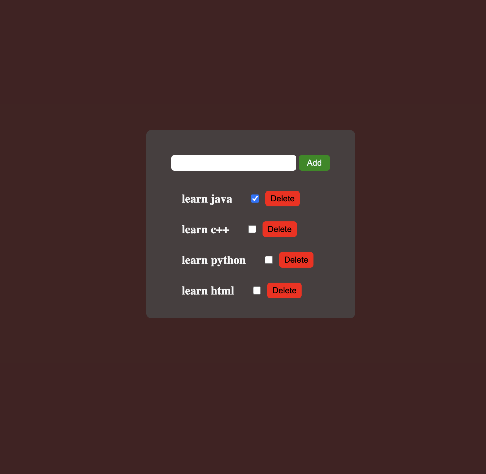

# Image gallery

> A simple

## Table of contents

- [General info](#general-info)
- [Screenshots](#screenshots)
- [Technologies](#technologies)
- [Setup](#setup)
- [Features](#features)
- [Status](#status)
- [Inspiration](#inspiration)
- [Contact](#contact)

## General info

> The objective of the project is to practice separation of concern in
> JavaScript.

## Screenshots

## Technologies

- JavaScript
- HTML5
- CSS3
- VSC code

## Setup

clone the repo and start using the stop watch.

## Code Examples

const addTodo = async (todoData) => {
    try {
        const res = await fetch('http://localhost:3000/todos', {
            method: 'POST',
            headers: {
                'Content-Type': 'application/json',
            },
            body: JSON.stringify(todoData),
        });

        if (!res.ok) {
            throw new Error(`Failed to add todo with status: ${res.status}`);
        }

        return await res.json();
    } catch (err) {
        console.log(err);
    }

## Features

List of features ready and Todos for future development

-
-
-

To-do list:

-
-

## Status

Project is: done

## Inspiration

## Contact
